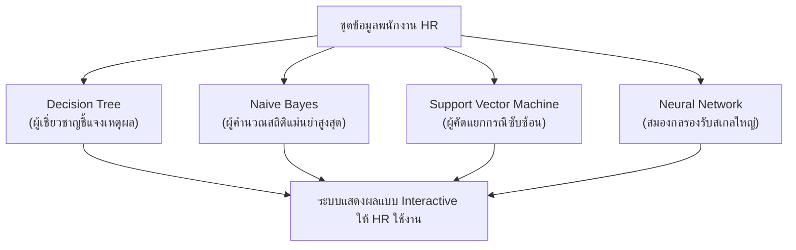

# 🧠 ระบบปัญญาประดิษฐ์เพื่อการวิเคราะห์ความพึงพอใจและอัตราการคงอยู่ของบุคลากร
## AI-Driven Employee Job Satisfaction & Retention Intelligence System

[](https://github.com/XevilA/IBM-HR-Analytics-Job-Satisfaction-AI)
[](https://github.com/XevilA/IBM-HR-Analytics-Job-Satisfaction-AI)
[](https://github.com/XevilA/IBM-HR-Analytics-Job-Satisfaction-AI)
[](https://001-009-016-ib5byag38gdzr4kmjilx2h.streamlit.app/)

---

## 📌 บทสรุปสำหรับผู้บริหารและผู้ใช้งานทั่วไป (Executive Summary)

ในยุคดิจิทัล **"บุคลากร" คือสินทรัพย์ที่มีมูลค่าสูงสุดขององค์กร** แต่ปัญหาคลาสสิกที่ฝ่ายทรัพยากรบุคคล (HR) และผู้บริหารต้องเผชิญอยู่เสมอคือ **"พนักงานที่กำลังหมดไฟหรือไม่มีความสุขมักไม่แสดงออก"** และมักจะรู้ตัวอีกทีเมื่อพนักงานยื่นใบลาออกแล้ว การทำแบบประเมินความพึงพอใจประจำปียังใช้เวลามาก และพนักงานมักไม่กล้าตอบตามความเป็นจริง

โครงงานนี้จึงได้พัฒนา **ระบบปัญญาประดิษฐ์ (AI) ช่วยคัดกรองระดับความพึงพอใจในการทำงานของพนักงานล่วงหน้า** โดยนำข้อมูลพื้นฐานการทำงานที่องค์กรมีอยู่แล้ว (เช่น ฐานเงินเดือน, ประสบการณ์ทำงาน, สภาพแวดล้อม, ตำแหน่งงาน) มาประมวลผลเพื่อทำนายระดับความสุขในการทำงาน 4 ระดับ เพื่อให้ทีม HR สามารถเข้าไปดูแลและรักษาพนักงานที่มีความเสี่ยงได้ทันท่วงทีก่อนเกิดการลาออกจริง

```
[ ข้อมูลพนักงานในระบบ HR ] ──▶ [ ระบบวิเคราะห์ปัญญาประดิษฐ์ (AI) ] ──▶ [ ผลประเมินความสุข 4 ระดับ + สัญญาณเตือนล่วงหน้า ]
```

---

## 🎯 ปัญหาจริงในองค์กรและประโยชน์ที่ได้รับ (Business Challenge & Value)

| ปัญหาเดิมในองค์กร (Traditional Pain Points) | สิ่งที่ระบบ AI เข้ามาช่วยแก้ปัญหา (AI Solution) |
| :--- | :--- |
| **ดูแลคนไม่ทัน:** บริษัทมีพนักงานหลายร้อยหลายพันคน HR ไม่สามารถพูดคุยอย่างลึกซึ้งได้ทุกคนในแต่ละเดือน | **ระบบคัดกรองอัตโนมัติ:** วิเคราะห์พนักงานทั้งบริษัทได้ในเสี้ยววินาที จัดกลุ่มคนที่ต้องการความช่วยเหลือเร่งด่วน |
| **รู้ช้าเกินไป:** พนักงานสะสมความไม่พอใจทีละน้อย จนถึงจุดตัดสินใจลาออกจึงยื่นเอกสาร | **ตรวจพบสัญญาณล่วงหน้า:** ประเมินแนวโน้มความพึงพอใจ ช่วยให้ผู้จัดการเข้าพูดคุยปรับปรุงงานได้ก่อนพนักงานจะหมดใจ |
| **แบบสอบถามไม่สะท้อนความจริง:** พนักงานกังวลเรื่องผลประเมิน จึงมักตอบแบบสอบถามระดับคะแนนกลางๆ | **ประเมินจากพฤติกรรมและข้อมูลจริง:** ใช้งานข้อมูลลักษณะงาน ประสบการณ์ และสภาพแวดล้อมที่เป็นกลาง |

---

## 💡 ข้อค้นพบสำคัญจากข้อมูลที่ผู้บริหารควรรู้ (Key Business Insights)

จากการนำข้อมูลพนักงานของ IBM HR Analytics (จำนวน 1,470 คน) มาวิเคราะห์ผ่านกระบวนการ Data Science พบข้อเท็จจริงสำคัญดังนี้:

1. **เงินเดือนและตำแหน่งไม่ได้การันตีความสุขเสมอไป:**  
   พนักงานที่มีเงินเดือนสูงหรือตำแหน่งงานสูง มีสัดส่วนระดับความพึงพอใจกระจายตัวใกล้เคียงกับพนักงานทั่วไป การเพิ่มค่าตอบแทนเพียงอย่างเดียวจึงไม่ใช่วิธีแก้ปัญหาความผูกพันในองค์กรที่เบ็ดเสร็จ
2. **ความพึงพอใจเป็นตัวทำนาย "การลาออก" ที่แม่นยำที่สุด:**  
   * กลุ่มพนักงานที่มีความพึงพอใจระดับต่ำสุด (ระดับ 1) มีอัตราการลาออกสูงถึง **22.8%**
   * ขณะที่กลุ่มพนักงานที่มีความพึงพอใจสูงสุด (ระดับ 4) มีอัตราการลาออกเพียง **11.3%**  
   *(ต่างกันมากถึง **2 เท่าตัว** ยืนยันว่าการดูแลความพึงพอใจช่วยลดต้นทุนการสรรหาพนักงานใหม่ได้อย่างมีนัยสำคัญ)*

---

## 🧠 ทำความรู้จัก 4 โมเดล AI ที่พัฒนาขึ้น (The 4 AI Models Explained)

โครงการนี้ได้ทดลองสร้างและเปรียบเทียบโมเดล AI หลากหลายรูปแบบ เพื่อให้ตอบโจทย์การใช้งานของธุรกิจจริง:



1. **Decision Tree (AI แบบโครงสร้างต้นไม้ตัดสินใจ - White-Box AI):**  
   * **บทบาท:** เหมาะที่สุดสำหรับผู้บริหารที่ต้องการ **"ความโปร่งใสและอธิบายเหตุผลได้ 100%"** โมเดลจะแจกแจงเกณฑ์เป็นข้อๆ เหมือน Flowchart เช่น ดูจากระดับรายได้และช่วงอายุ
   * **ผลความแม่นยำ:** 27.55% (สอดคล้องตามที่นำเสนอในสไลด์ของกลุ่ม)
2. **Naive Bayes (AI แบบคำนวณความน่าจะเป็น):**  
   * **บทบาท:** ประมวลผลรวดเร็วมาก ให้คำตอบเป็นสัดส่วนเปอร์เซ็นต์ความน่าจะเป็นครบทั้ง 4 ระดับ เหมาะกับการทำ Dashboard มอนิเตอร์แบบ Real-time
   * **ผลความแม่นยำ:** **31.29% (มีความแม่นยำสูงสุดในการทดสอบครั้งนี้)**
3. **Support Vector Machine - SVM (AI แบบแบ่งขอบเขตพื้นที่):**  
   * **บทบาท:** เก่งในการหาเส้นแบ่งความสัมพันธ์ที่ซับซ้อน ไม่แปรปรวนง่ายตามสัญญาณรบกวนของข้อมูล
   * **ผลความแม่นยำ:** 25.85%
4. **Deep Neural Network - MLP (โครงข่ายประสาทเทียมจำลองสมองมนุษย์):**  
   * **บทบาท:** ออกแบบหลายชั้นโครงข่ายเพื่อเตรียมพร้อมสำหรับการขยายผล รองรับเมื่อองค์กรมีปริมาณข้อมูลพนักงานสะสมหลักหมื่นถึงหลักแสนคนในอนาคต
   * **ผลความแม่นยำ:** 28.91%

> *(หมายเหตุ: โจทย์นี้มี 4 ทางเลือก เกณฑ์มาตรฐานของการเดาสุ่มปกติจะอยู่ที่ 25.00% ดังนั้นทุกโมเดลที่พัฒนาขึ้นสามารถเรียนรู้รูปแบบข้อมูลได้สูงกว่าเกณฑ์สุ่มจริง)*

---

## 🖥️ วิธีการเปิดใช้งานและตรวจสอบชิ้นงาน (User & Reviewer Guide)

### 1. ทดลองใช้งานหน้าจอระบบจริง (Interactive Web Demo)
ผู้บริหารหรือผู้ใช้งานทั่วไปสามารถทดลองกรอกข้อมูลพนักงานเพื่อดูผลการประเมินได้ทันทีผ่านเว็บเบราว์เซอร์:
* 🌐 **ลิงก์ทดลองระบบ:** [คลิกเปิดระบบทดสอบออนไลน์ Streamlit](https://001-009-016-ib5byag38gdzr4kmjilx2h.streamlit.app/)
* หรือเปิดรันบนเครื่องคอมพิวเตอร์ของคุณด้วยคำสั่ง:
  ```bash
  pip install -r requirements.txt
  streamlit run app.py
  ```

### 2. เอกสารรายงานและสไลด์สรุปโครงงาน
* 📑 **สไลด์นำเสนอฉบับผู้บริหาร (PDF 11 สไลด์):** [คลิกดูเอกสารสไลด์นำเสนอ](AI_จำแนกระดับความพึงพอใจในการทำงานของพนักงาน.pdf)
* 📄 **รายงานใบงานตามรายวิชา (.doc):** บรรจุอยู่ในโฟลเดอร์ [`02_Assignment_Docs_Word/`](02_Assignment_Docs_Word/) ครบทั้ง 10 สัปดาห์ (ใบงานที่ 01 ถึง 11)

### 3. สมุดโค้ดการทดลองสำหรับนักพัฒนาและผู้ตรวจวิชาการ (Google Colab)
อยู่ในโฟลเดอร์ [`01_Colab_Notebooks/`](01_Colab_Notebooks/) ซึ่งมีระบบ **Auto-Setup** ในตัว สามารถคลิกเปิดบน Google Colab แล้วกดรันได้ทันทีโดยไม่ต้องอัปโหลดไฟล์เสริม:
* `work01_Data_Loading_Pandas.ipynb` — การสำรวจและโหลดข้อมูล
* `work02_ML_Types_and_Target.ipynb` — การกำหนดโจทย์และคลาสเป้าหมาย
* `work03_Data_Cleaning_and_Preprocessing.ipynb` — การทำความสะอาดข้อมูล
* `work04_Exploratory_Data_Analysis_EDA.ipynb` — การวิเคราะห์เชิงสถิติและการกระจายตัว
* `work05_Decision_Tree.ipynb` — การสร้างโมเดลต้นไม้ตัดสินใจ
* `work06_Neural_Network_MLP.ipynb` — การสร้างโครงข่ายประสาทเทียมเบื้องต้น
* `work07_Support_Vector_Machine_SVM.ipynb` — การสร้างโมเดล SVM
* `work08_Naive_Bayes.ipynb` — การสร้างโมเดล Naive Bayes
* `work10_Genetic_Algorithm_Feature_Selection.ipynb` — การคัดเลือกฟีเจอร์ด้วย Genetic Algorithm
* `work11_Model_Optimization_and_Comparison.ipynb` — การปรับแต่งและเปรียบเทียบโมเดล
* `work_all_in_one_master.ipynb` — **สมุดงานหลักรวมทุกขั้นตอนตั้งแต่ต้นจนจบในไฟล์เดียว**

---

## 👥 คณะผู้จัดทำ (Project Members)

**กลุ่มโครงงาน: TEAM-99**  
สาขาวิชาเทคโนโลยีธุรกิจดิจิทัล / วิทยาการคอมพิวเตอร์  
มหาวิทยาลัยเทคโนโลยีราชมงคลสุวรรณภูมิ (RMUTSB)

1. **น.ส.กมลวรรณ จันทร์ผึ้ง** (รหัสนักศึกษา: 001)
2. **น.ส.ชลดา อิศรเสนา ณ อยุธยา** (รหัสนักศึกษา: 009)
3. **น.ส.ณัฐพร เผือกผ่อง** (รหัสนักศึกษา: 016)

---
*เอกสารนี้จัดทำขึ้นเพื่อการศึกษาและการประยุกต์ใช้ปัญญาประดิษฐ์ในธุรกิจดิจิทัล ภาคการศึกษา 1/2569*
